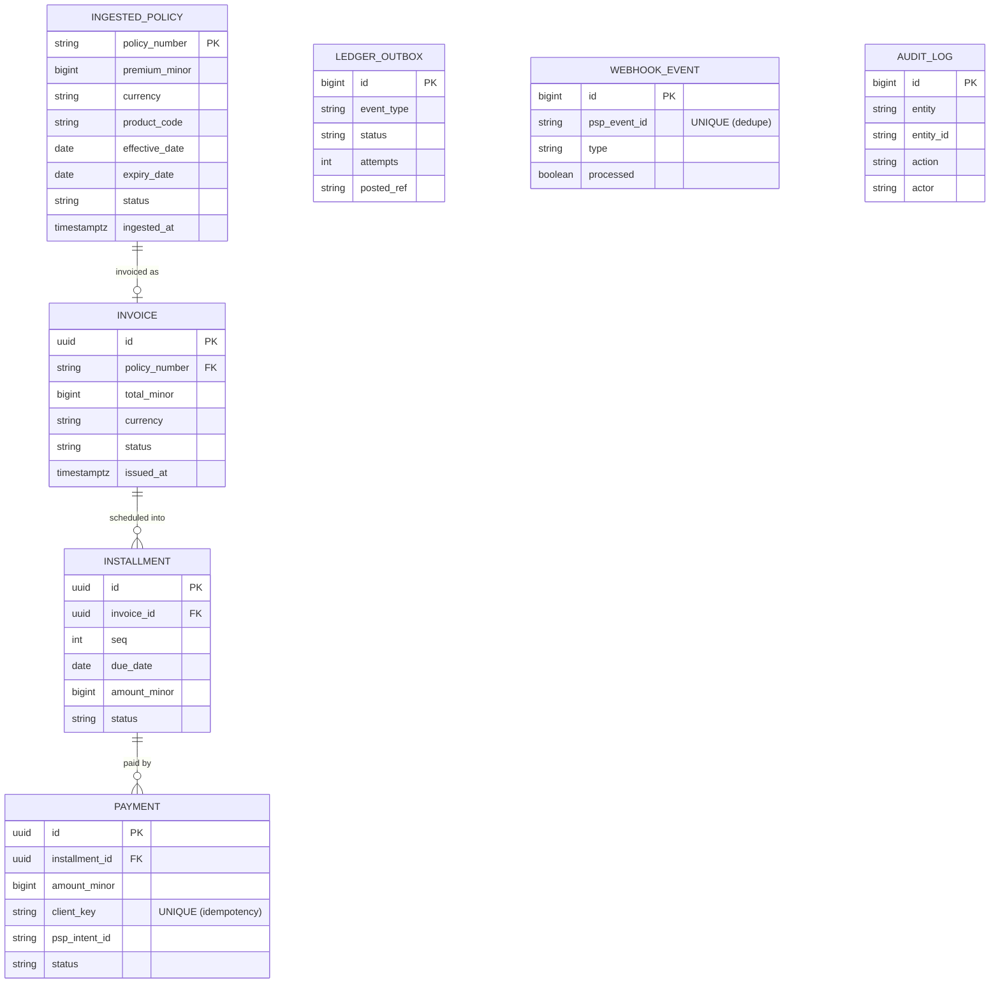

# System Design Document — ktayl-core (Billing)

> The **single source of truth** for ktayl-core's architecture — the Solution Architecture Document
> assembled from the PRD + architecture + ADR-001/002/003 + SPEC (assemble, don't duplicate: each section
> links the authoritative doc). Follows `minicloud-gitops/docs/templates/sdd-template.md`.

- **Product / repo:** ktayl-core (insurance-LOB modular monolith) · **Owner:** AndreLiar (SA/TL)
- **Status:** as-built for BILL-010/011; forward-looking for BILL-012–016 · **Date:** 2026-10-06
- **Delivery path:** C · **Board:** #28

> Three audience-tagged views: **Conceptual** (§1 — PM/stakeholder) · **Component** (§3–§5 — engineers) ·
> **Operational** (§6 — DevOps/SRE). Diagrams over prose; consistent names; the *why* in the ADR log (§8).

## 1. Conceptual view — what it does & why it matters  *(for PM / stakeholder / new hire)*
In plain terms: ktayl can **sell and bind** an insurance policy, but until now it had **no way to collect
the premium** — a bound policy generated no invoice, no payment, no accounting entry. **Billing closes
that loop**: it turns a bound policy into **an invoice the customer pays, and a booked entry in the
general ledger**. It's the "money" link of the insurance value chain
(Submission → Underwriting → Policy bind → **Billing** → Claims). ktayl-core is the modular-monolith that
hosts Billing (and future insurance domains) as *modules*, not separate services.
→ [PRD](../prd.md), [architecture](../architecture.md).

## 2. Requirements
### 2.1 Functional
Ingest a bound policy's premium · raise a premium invoice + installment schedule · capture payment (Stripe
test, SEPA DD, webhook-driven) · post double-entry Journal Entries to ERPNext · expose who-owes-what. → PRD.
### 2.2 Non-functional (NFR)
p95 < 300 ms (GL post off the request path) · dev 1 / prod 2 replicas · money = **integer eurocents** ·
GL post **async + retried** (an ERPNext blip never blocks invoicing) · transactional consistency
(`@Transactional` + outbox) · structured logs + `/actuator` + Prometheus. JVM footprint ~512Mi–768Mi req /
1Gi limit per replica (fits the insurance ns quota). SLO row → `slo-register.md` (ktayl-core: ingest lag
< 60 s; 100% balanced JE; RTO 30m / RPO 24h).
### 2.3 Technical → user-outcome translation
| Requirement | Technical choice | Business outcome |
|---|---|---|
| Reliable ingest | durable JetStream consumer (ADR-003) | "a policy bound while Billing is down still gets invoiced" |
| No lost/double money move | transactional outbox → ERPNext GL | "every payment posts to the ledger exactly once, balanced" |
| Correct money | integer eurocents; total = Σ installments | "invoices always reconcile to the cent" |
| Safe payments | Stripe test SEPA DD + signature-verified webhook | "payment confirmation can't be forged or double-counted" |
| Fast UI | GL post off the request path (async) | "the invoice/payment action returns in < 300 ms" |

## 3. System architecture (C4)  *(Component + Operational views — for engineers / DevOps)*
**Context** — Underwriting (bound-risk event) → ktayl-core → ERPNext GL + Stripe(test) + Postgres; Finance
user via Authentik SSO. **Container** — one Spring Boot deployable; modules `billing` (CLOSED) + `shared`
(OPEN); boundary ports `UnderwritingEventConsumer` (NATS JetStream), `LedgerClient` (ERPNext),
`PaymentGatewayClient` (Stripe) + the `/webhooks/stripe` inbound. **Deployment** — GAP wrapper chart, ns
`ktayl-core`/`ktayl-core-prod`, Kargo git-Warehouse (BILL-016). Boundaries: owns the `billing` schema;
integrates with Underwriting/ERPNext/Stripe as external systems. → full diagrams in [architecture §1–§2](../architecture.md).

## 4. Data design
**Store:** PostgreSQL, **schema-per-module** (`billing`); money is **`bigint` eurocents** (never float);
`audit_log` is append-only. **Migrations:** Flyway (`V1` baseline + `schema_marker`; `V2` ingest + audit —
both live). Planned `V3+` add invoice/installment/payment/webhook_event/ledger_outbox (BILL-012–014).
**Ownership:** ktayl-core owns all `billing` tables; policyholder identity + premium = CONFIDENTIAL/PII,
server-side only. ERD (live = solid, planned = BILL-012+):

## 5. API specification
Contract → **[`api/openapi.yaml`](../../api/openapi.yaml)**. Surface:

| Method · path | Auth | Purpose | Status |
|---|---|---|---|
| `GET /actuator/health` | none | liveness/readiness probes | ✅ live |
| `GET /api/billing/ping` | Authentik JWT | module smoke | ✅ live |
| `POST /webhooks/stripe` | **Stripe signature** (not SSO) | SEPA-DD payment confirmation; idempotent by event id | 🔜 BILL-013b |
| `GET /api/billing/policies/{policyNumber}` | JWT (Finance) | who-owes-what (invoice + installments + outstanding) | 🔜 BILL-012/015 |
| `POST /api/billing/policies/{policyNumber}/invoice` | JWT (Finance) | raise the premium invoice (idempotent per policy) | 🔜 BILL-012 |
| `POST /api/billing/installments/{id}/pay` | JWT (Finance) | initiate a SEPA-DD PaymentIntent (idempotent by client_key) | 🔜 BILL-013a |

Every endpoint follows the `documentation.md` rule (auth · body · validation → 4xx not 5xx · status ·
idempotency). The **ingest path is an event, not an endpoint** (durable JetStream consumer, ADR-003). The
consumed contracts (UW bound-risk event, ERPNext JE, Stripe) are pinned by **L3 contract tests**.

## 6. Operational & scaling strategy
**Envs/promotion:** dev/prod, **Kargo git-Warehouse** (commit-keyed — JVM base-layer date breaks
NewestBuild), CODEOWNERS prod gate. **Scaling:** prod 2 replicas; GL post off the request path; the ingest
consumer is single (prod-authoritative; dev blank). **SLO + failure:** ingest lag < 60 s, 100% balanced
JE; PAS/ERPNext/Stripe down → retried/outbox/pending, **never a half-posted money move**; Game Day
scenarios 03/04/08 apply. **Backup/DR:** CNPG (RTO 30m / RPO 24h). → [architecture §6–§8](../architecture.md).

## 7. Security & compliance
Authentik OIDC resource-server; Finance-group-gated; the Stripe webhook is the one non-SSO path
(signature-verified + idempotent). Secrets via ESO→Vault (DB, ERPNext, Stripe test keys). Default-deny
egress → DNS + NATS + ERPNext + Postgres + `api.stripe.com`. **No PCI scope** (Stripe tokenises).
**Threat model** = the governance-gate sign-off in [architecture §10](../architecture.md). **Compliance:**
Solvency II / IFRS 17 (premium recognition) · GDPR · DORA (Stripe = third-party ICT register) · ACPR.
Cert: **BC02 + BC03**.

## 8. Decision log (ADRs)
| ADR | Decision | Trade-off settled |
|---|---|---|
| [001](adr/ADR-001-stack-spring-modulith.md) | Spring Boot + Spring Modulith (Java 21) | transactional-insurance fit + **enforced** module boundaries vs NestJS velocity |
| [002](adr/ADR-002-payment-psp-stripe-sepa.md) | Stripe test + SEPA DD, webhook-driven | domain-correct EU premium + real PSP mechanics vs mock simplicity |
| [003](adr/ADR-003-ingest-underwriting-event.md) | ingest the UW bound-risk event via a JetStream stream | reliable/replayable + zero UW change vs a PAS poll (PAS has no premium) |

## 9. Open questions / deferred
Billing **workload** not yet deployed (BILL-016). Invoice/payment/GL endpoints planned (BILL-012–014).
`holder_name` enrichment from the PAS deferred (display-only). Installments: single annual first,
schedule-ready. Stripe test account + keys → Vault at BILL-013a.
