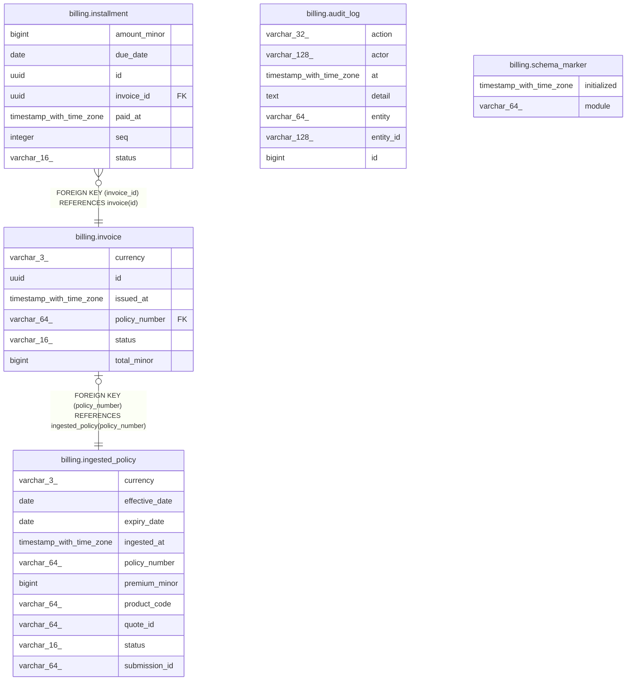

# ktayl_core

## Tables

| Name                                                  | Columns | Comment | Type       |
| ----------------------------------------------------- | ------- | ------- | ---------- |
| [billing.audit_log](billing.audit_log.md)             | 7       |         | BASE TABLE |
| [billing.ingested_policy](billing.ingested_policy.md) | 10      |         | BASE TABLE |
| [billing.installment](billing.installment.md)         | 7       |         | BASE TABLE |
| [billing.invoice](billing.invoice.md)                 | 6       |         | BASE TABLE |
| [billing.schema_marker](billing.schema_marker.md)     | 2       |         | BASE TABLE |

## Relations

---

> Generated by [tbls](https://github.com/k1LoW/tbls)
