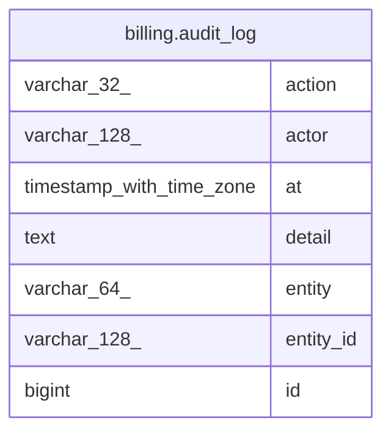

# billing.audit_log

## Columns

| Name      | Type                     | Default | Nullable | Children | Parents | Comment |
| --------- | ------------------------ | ------- | -------- | -------- | ------- | ------- |
| action    | varchar(32)              |         | false    |          |         |         |
| actor     | varchar(128)             |         | false    |          |         |         |
| at        | timestamp with time zone | now()   | false    |          |         |         |
| detail    | text                     |         | true     |          |         |         |
| entity    | varchar(64)              |         | false    |          |         |         |
| entity_id | varchar(128)             |         | false    |          |         |         |
| id        | bigint                   |         | false    |          |         |         |

## Constraints

| Name           | Type        | Definition       |
| -------------- | ----------- | ---------------- |
| audit_log_pkey | PRIMARY KEY | PRIMARY KEY (id) |

## Indexes

| Name             | Definition                                                                         |
| ---------------- | ---------------------------------------------------------------------------------- |
| audit_log_pkey   | CREATE UNIQUE INDEX audit_log_pkey ON billing.audit_log USING btree (id)           |
| idx_audit_entity | CREATE INDEX idx_audit_entity ON billing.audit_log USING btree (entity, entity_id) |

## Relations

---

> Generated by [tbls](https://github.com/k1LoW/tbls)
