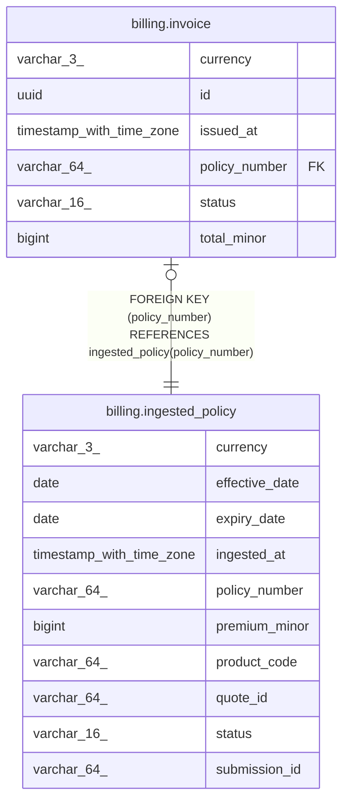

# billing.ingested_policy

## Columns

| Name           | Type                     | Default                       | Nullable | Children                              | Parents | Comment |
| -------------- | ------------------------ | ----------------------------- | -------- | ------------------------------------- | ------- | ------- |
| currency       | varchar(3)               |                               | false    |                                       |         |         |
| effective_date | date                     |                               | false    |                                       |         |         |
| expiry_date    | date                     |                               | false    |                                       |         |         |
| ingested_at    | timestamp with time zone | now()                         | false    |                                       |         |         |
| policy_number  | varchar(64)              |                               | false    | [billing.invoice](billing.invoice.md) |         |         |
| premium_minor  | bigint                   |                               | false    |                                       |         |         |
| product_code   | varchar(64)              |                               | false    |                                       |         |         |
| quote_id       | varchar(64)              |                               | true     |                                       |         |         |
| status         | varchar(16)              | 'ingested'::character varying | false    |                                       |         |         |
| submission_id  | varchar(64)              |                               | true     |                                       |         |         |

## Constraints

| Name                                | Type        | Definition                  |
| ----------------------------------- | ----------- | --------------------------- |
| ingested_policy_pkey                | PRIMARY KEY | PRIMARY KEY (policy_number) |
| ingested_policy_premium_minor_check | CHECK       | CHECK ((premium_minor > 0)) |

## Indexes

| Name                 | Definition                                                                                      |
| -------------------- | ----------------------------------------------------------------------------------------------- |
| ingested_policy_pkey | CREATE UNIQUE INDEX ingested_policy_pkey ON billing.ingested_policy USING btree (policy_number) |

## Relations

---

> Generated by [tbls](https://github.com/k1LoW/tbls)
