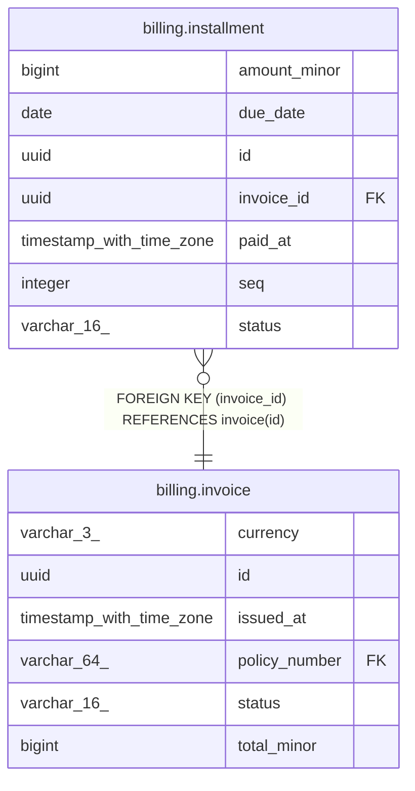

# billing.installment

## Columns

| Name         | Type                     | Default                   | Nullable | Children | Parents                               | Comment |
| ------------ | ------------------------ | ------------------------- | -------- | -------- | ------------------------------------- | ------- |
| amount_minor | bigint                   |                           | false    |          |                                       |         |
| due_date     | date                     |                           | false    |          |                                       |         |
| id           | uuid                     |                           | false    |          |                                       |         |
| invoice_id   | uuid                     |                           | false    |          | [billing.invoice](billing.invoice.md) |         |
| paid_at      | timestamp with time zone |                           | true     |          |                                       |         |
| seq          | integer                  |                           | false    |          |                                       |         |
| status       | varchar(16)              | 'open'::character varying | false    |          |                                       |         |

## Constraints

| Name                           | Type        | Definition                                      |
| ------------------------------ | ----------- | ----------------------------------------------- |
| installment_amount_minor_check | CHECK       | CHECK ((amount_minor > 0))                      |
| installment_invoice_id_fkey    | FOREIGN KEY | FOREIGN KEY (invoice_id) REFERENCES invoice(id) |
| installment_invoice_id_seq_key | UNIQUE      | UNIQUE (invoice_id, seq)                        |
| installment_pkey               | PRIMARY KEY | PRIMARY KEY (id)                                |

## Indexes

| Name                           | Definition                                                                                              |
| ------------------------------ | ------------------------------------------------------------------------------------------------------- |
| idx_installment_invoice        | CREATE INDEX idx_installment_invoice ON billing.installment USING btree (invoice_id)                    |
| installment_invoice_id_seq_key | CREATE UNIQUE INDEX installment_invoice_id_seq_key ON billing.installment USING btree (invoice_id, seq) |
| installment_pkey               | CREATE UNIQUE INDEX installment_pkey ON billing.installment USING btree (id)                            |

## Relations

---

> Generated by [tbls](https://github.com/k1LoW/tbls)
