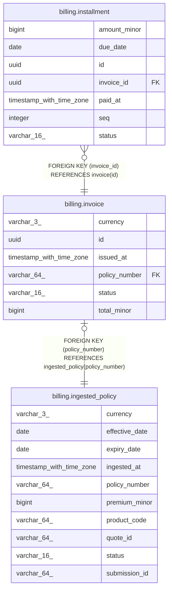

# billing.invoice

## Columns

| Name          | Type                     | Default                     | Nullable | Children                                      | Parents                                               | Comment |
| ------------- | ------------------------ | --------------------------- | -------- | --------------------------------------------- | ----------------------------------------------------- | ------- |
| currency      | varchar(3)               |                             | false    |                                               |                                                       |         |
| id            | uuid                     |                             | false    | [billing.installment](billing.installment.md) |                                                       |         |
| issued_at     | timestamp with time zone | now()                       | false    |                                               |                                                       |         |
| policy_number | varchar(64)              |                             | false    |                                               | [billing.ingested_policy](billing.ingested_policy.md) |         |
| status        | varchar(16)              | 'issued'::character varying | false    |                                               |                                                       |         |
| total_minor   | bigint                   |                             | false    |                                               |                                                       |         |

## Constraints

| Name                       | Type        | Definition                                                            |
| -------------------------- | ----------- | --------------------------------------------------------------------- |
| invoice_pkey               | PRIMARY KEY | PRIMARY KEY (id)                                                      |
| invoice_policy_number_fkey | FOREIGN KEY | FOREIGN KEY (policy_number) REFERENCES ingested_policy(policy_number) |
| invoice_policy_number_key  | UNIQUE      | UNIQUE (policy_number)                                                |
| invoice_total_minor_check  | CHECK       | CHECK ((total_minor > 0))                                             |

## Indexes

| Name                      | Definition                                                                                   |
| ------------------------- | -------------------------------------------------------------------------------------------- |
| invoice_pkey              | CREATE UNIQUE INDEX invoice_pkey ON billing.invoice USING btree (id)                         |
| invoice_policy_number_key | CREATE UNIQUE INDEX invoice_policy_number_key ON billing.invoice USING btree (policy_number) |

## Relations

---

> Generated by [tbls](https://github.com/k1LoW/tbls)
