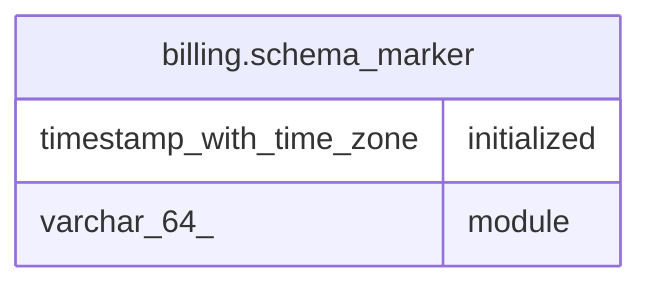

# billing.schema_marker

## Columns

| Name        | Type                     | Default | Nullable | Children | Parents | Comment |
| ----------- | ------------------------ | ------- | -------- | -------- | ------- | ------- |
| initialized | timestamp with time zone | now()   | false    |          |         |         |
| module      | varchar(64)              |         | false    |          |         |         |

## Constraints

| Name               | Type        | Definition           |
| ------------------ | ----------- | -------------------- |
| schema_marker_pkey | PRIMARY KEY | PRIMARY KEY (module) |

## Indexes

| Name               | Definition                                                                           |
| ------------------ | ------------------------------------------------------------------------------------ |
| schema_marker_pkey | CREATE UNIQUE INDEX schema_marker_pkey ON billing.schema_marker USING btree (module) |

## Relations

---

> Generated by [tbls](https://github.com/k1LoW/tbls)
